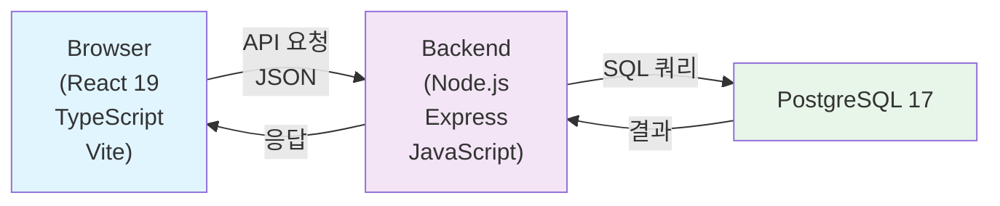
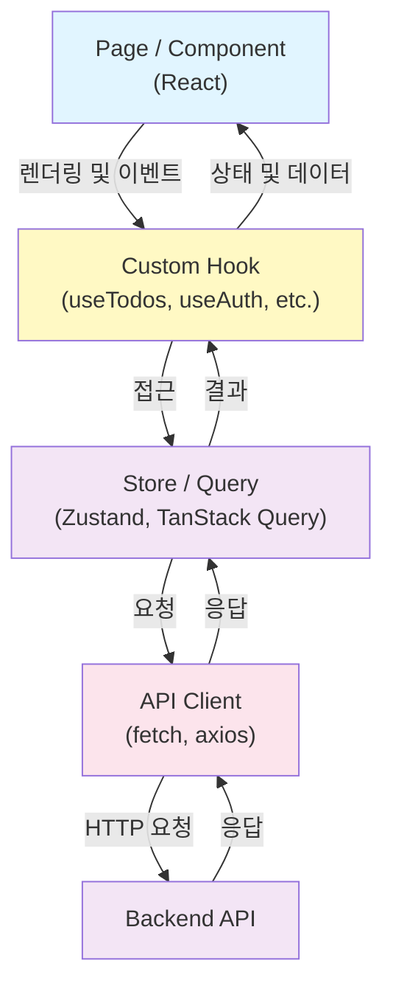
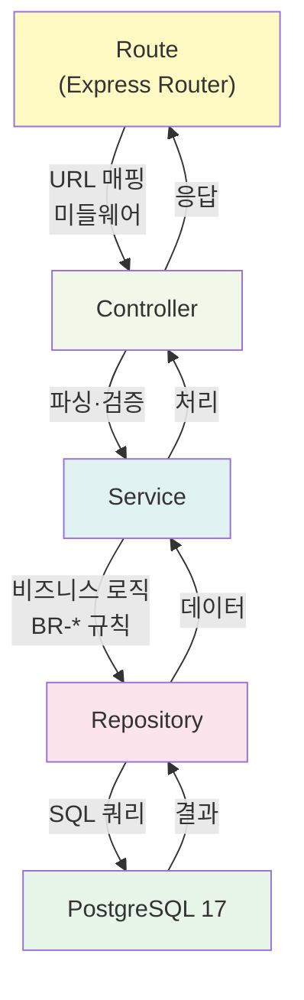

# 기술 아키텍처 다이어그램

> 버전: 1.0 | 작성일: 2026-05-27

---

## 버전 이력

| 버전 | 날짜       | 변경 내용 |
| ---- | ---------- | --------- |
| 1.0  | 2026-05-27 | 최초 작성 |

---

## 다이어그램 1 — 전체 시스템 구성

시스템은 3계층으로 구성되며, 사용자의 브라우저에서 시작하여 백엔드를 거쳐 데이터베이스에 도달하는 단방향 흐름을 따릅니다.

---

## 다이어그램 2 — 프론트엔드 레이어

프론트엔드는 UI에서 API까지 4단계 계층으로 구성되며, 컴포넌트는 항상 Hook을 통해 상태 및 서버 데이터에 접근합니다.

---

## 다이어그램 3 — 백엔드 레이어

백엔드는 라우팅에서 데이터베이스까지 5단계 계층으로 구성되며, 비즈니스 로직은 Service 계층에서 집중 관리됩니다.

