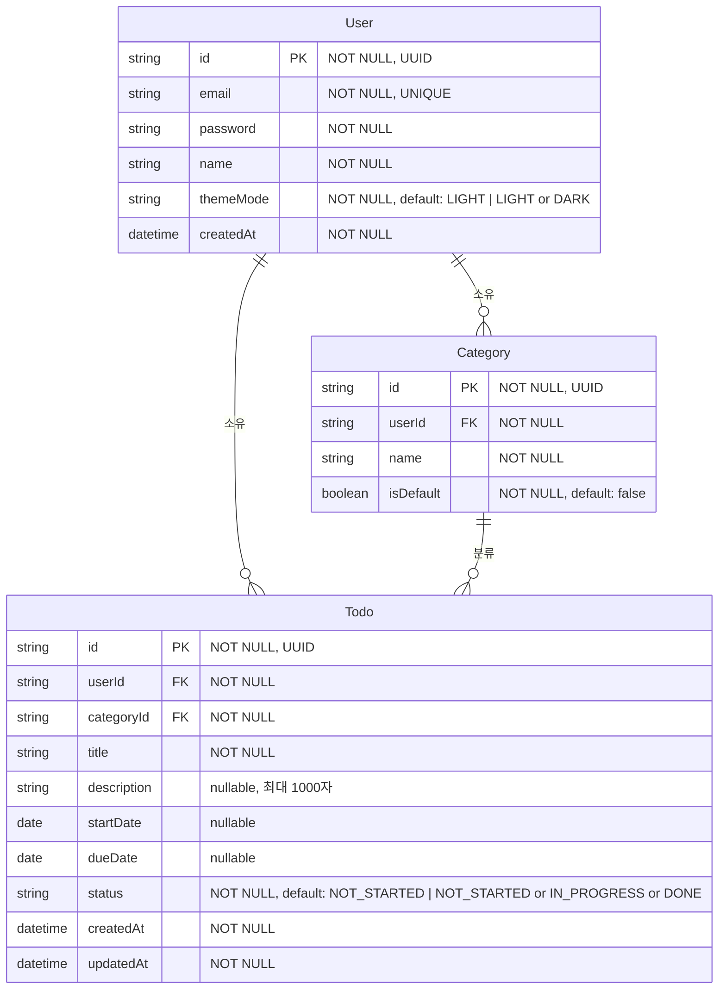

# ERD — TodoList 웹 애플리케이션

> 버전: 1.0 | 작성일: 2026-05-27

## 버전 이력

| 버전 | 날짜       | 변경 내용 |
| ---- | ---------- | --------- |
| 1.0  | 2026-05-27 | 최초 작성 |

---

## ERD 다이어그램

---

## 엔티티 설명

### User (사용자)

| 속성명    | 타입     | 제약                          | 설명                   |
| --------- | -------- | ----------------------------- | ---------------------- |
| id        | UUID     | NOT NULL, PK                  | 고유 식별자            |
| email     | String   | NOT NULL, UNIQUE, 이메일 형식 | 로그인 ID              |
| password  | String   | NOT NULL, 최소 8자, 영문+숫자 | 암호화된 비밀번호      |
| name      | String   | NOT NULL, 1~50자              | 사용자 이름            |
| themeMode | Enum     | NOT NULL, default: LIGHT      | UI 테마: LIGHT \| DARK |
| createdAt | DateTime | NOT NULL                      | 가입 일시              |

### Category (카테고리)

| 속성명    | 타입    | 제약                     | 설명                 |
| --------- | ------- | ------------------------ | -------------------- |
| id        | UUID    | NOT NULL, PK             | 고유 식별자          |
| userId    | UUID    | NOT NULL, FK(User)       | 소유 사용자          |
| name      | String  | NOT NULL, 1~30자         | 카테고리명           |
| isDefault | Boolean | NOT NULL, default: false | '기본' 카테고리 여부 |

### Todo (할 일)

| 속성명      | 타입     | 제약                           | 설명                                          |
| ----------- | -------- | ------------------------------ | --------------------------------------------- |
| id          | UUID     | NOT NULL, PK                   | 고유 식별자                                   |
| userId      | UUID     | NOT NULL, FK(User)             | 소유 사용자                                   |
| categoryId  | UUID     | NOT NULL, FK(Category)         | 소속 카테고리 (기본값: 기본 카테고리)         |
| title       | String   | NOT NULL, 1~100자              | 할 일 제목                                    |
| description | String   | nullable, 최대 1000자          | 상세 내용 (선택)                              |
| startDate   | Date     | nullable                       | 시작일 (선택)                                 |
| dueDate     | Date     | nullable, startDate 이상       | 종료일 (선택)                                 |
| status      | Enum     | NOT NULL, default: NOT_STARTED | 저장 상태: NOT_STARTED \| IN_PROGRESS \| DONE |
| createdAt   | DateTime | NOT NULL                       | 등록 일시                                     |
| updatedAt   | DateTime | NOT NULL                       | 최종 수정 일시                                |

---

## 비즈니스 규칙 요약

ERD에서 직접 표현하기 어려운 규칙들을 나열한다.

- **BR-05** 회원가입 시 '기본' 카테고리(isDefault=true)가 자동 생성된다.
- **BR-06** '기본' 카테고리(isDefault=true)는 삭제할 수 없다.
- **BR-07** 사용자 정의 카테고리 삭제 시, 해당 카테고리의 할 일은 '기본' 카테고리로 자동 이관된다.
- **BR-08** 할 일 등록 시 카테고리 미지정이면 '기본' 카테고리가 자동 적용된다.
- **BR-09** dueDate는 startDate와 같거나 이후여야 한다.
- **BR-10** status는 사용자의 명시적 조작으로만 변경되며, 날짜 변경으로 자동 전이되지 않는다.
- **OVERDUE** 기한 초과 상태(dueDate < 오늘 AND status != DONE)는 파생 상태로 DB에 저장되지 않으며 조회 시 계산된다.
