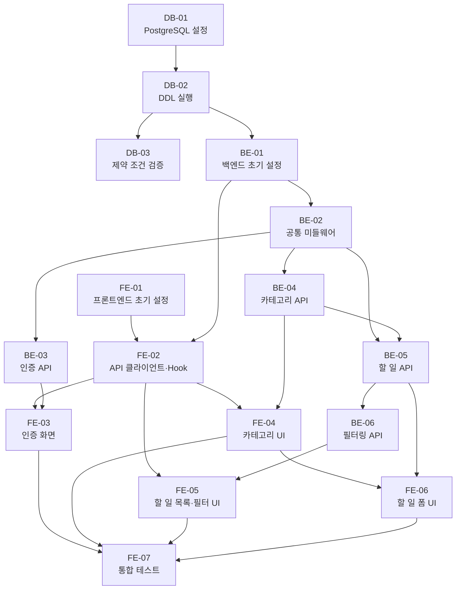

# 실행계획 — TodoList 웹 애플리케이션

> 버전: 1.1 | 작성일: 2026-05-28

## 버전 이력

| 버전 | 날짜       | 변경 내용 |
| ---- | ---------- | --------- |
| 1.0  | 2026-05-28 | 최초 작성 |
| 1.1  | 2026-05-28 | 전체 실행 흐름 섹션 추가 — 의존성 흐름도·병렬 착수 시점 표 |

---

## 1. 전체 task 목록

| task 번호 | task명                                              | 레이어      | 예상 소요시간 | 의존 task          |
| --------- | --------------------------------------------------- | ----------- | ------------- | ------------------ |
| DB-01     | 개발 환경 PostgreSQL 설정 및 데이터베이스 생성      | DB          | 1~2시간       | 없음               |
| DB-02     | schema.sql DDL 실행 (ENUM, 테이블, 인덱스, 트리거)  | DB          | 1시간         | DB-01              |
| DB-03     | 초기 데이터 검증 (제약 조건, FK, CHECK 동작 확인)   | DB          | 1시간         | DB-02              |
| BE-01     | 프로젝트 초기 설정 (Express 앱, 환경변수, DB pool)  | 백엔드      | 1~2시간       | DB-02              |
| BE-02     | 공통 미들웨어 (인증, 에러 핸들러)                   | 백엔드      | 1~2시간       | BE-01              |
| BE-03     | 인증 API (UC-01 회원가입, UC-02 로그인, UC-03 수정, UC-04 탈퇴) | 백엔드 | 3~4시간 | BE-02        |
| BE-04     | 카테고리 API (UC-05 생성, UC-06 삭제)               | 백엔드      | 1~2시간       | BE-02              |
| BE-05     | 할 일 API (UC-07 등록, UC-08 수정, UC-09 삭제, UC-10 상태 변경) | 백엔드 | 3~4시간 | BE-02, BE-04 |
| BE-06     | 필터링 API (UC-11 상태별·기한 초과, UC-12 카테고리별) | 백엔드    | 1~2시간       | BE-05              |
| FE-01     | 프로젝트 초기 설정 (Vite + React 19 + TypeScript, 라우터, TanStack Query) | 프론트엔드 | 1~2시간 | 없음    |
| FE-02     | API 클라이언트 및 공통 Hook 설정                    | 프론트엔드  | 1~2시간       | FE-01, BE-01       |
| FE-03     | 인증 화면 (회원가입, 로그인, 내 정보 수정, 회원 탈퇴) | 프론트엔드 | 3~4시간      | FE-02, BE-03       |
| FE-04     | 카테고리 관리 UI                                    | 프론트엔드  | 1~2시간       | FE-02, BE-04       |
| FE-05     | 할 일 목록 및 필터링 UI                             | 프론트엔드  | 2~3시간       | FE-02, BE-06       |
| FE-06     | 할 일 등록/수정 폼 UI                               | 프론트엔드  | 2~3시간       | FE-04, BE-05       |
| FE-07     | 통합 테스트 및 반응형 UI 검증                       | 프론트엔드  | 2~3시간       | FE-03~FE-06        |

---

## 2. DB task 상세

### DB-01: 개발 환경 PostgreSQL 설정 및 데이터베이스 생성

**설명**: 로컬 개발 환경에 PostgreSQL 17을 설치·구성하고 `todolist` 데이터베이스와 전용 사용자를 생성한다.

**의존성**
- [ ] (없음)

**완료 조건**
- [ ] PostgreSQL 17이 로컬 환경에 설치되어 서비스가 정상 실행 중인 상태이다
- [ ] `todolist` 데이터베이스가 생성되어 있다
- [ ] DB 접속용 전용 사용자 계정이 생성되어 있고, 해당 DB에 대한 권한이 부여되어 있다
- [ ] `backend/.env` 파일에 `DB_HOST`, `DB_PORT`, `DB_NAME`, `DB_USER`, `DB_PASSWORD` 값이 설정되어 있다
- [ ] `psql` 또는 `pg` 라이브러리를 통해 `todolist` DB에 정상 접속이 확인된다

---

### DB-02: schema.sql DDL 실행 (ENUM, 테이블, 인덱스, 트리거)

**설명**: `database/schema.sql`을 실행하여 ENUM 타입, 테이블 3개(user, category, todo), 인덱스 4개, `updated_at` 트리거를 생성한다.

**의존성**
- [ ] DB-01 완료

**완료 조건**
- [ ] `theme_mode` ENUM 타입(`LIGHT`, `DARK`)이 생성되어 있다
- [ ] `todo_status` ENUM 타입(`NOT_STARTED`, `IN_PROGRESS`, `DONE`)이 생성되어 있다
- [ ] `user` 테이블이 생성되어 있고, `id`, `email`, `password`, `name`, `theme_mode`, `created_at` 컬럼을 보유한다
- [ ] `category` 테이블이 생성되어 있고, `user_id`에 `ON DELETE CASCADE` FK가 적용되어 있다
- [ ] `todo` 테이블이 생성되어 있고, `category_id`에 `ON DELETE RESTRICT` FK가 적용되어 있다
- [ ] `todo` 테이블의 `chk_due_date` CHECK 제약 조건이 생성되어 있다
- [ ] `set_updated_at` 함수 및 `trg_todo_updated_at` 트리거가 생성되어 있다
- [ ] 인덱스 4개(`idx_category_user_id`, `idx_todo_user_id`, `idx_todo_category_id`, `idx_todo_user_status`, `idx_todo_due_date`)가 생성되어 있다

---

### DB-03: 초기 데이터 검증 (제약 조건, FK, CHECK 동작 확인)

**설명**: SQL 쿼리를 직접 실행하여 각 테이블의 제약 조건·FK·CHECK·트리거가 의도대로 동작하는지 확인한다.

**의존성**
- [ ] DB-02 완료

**완료 조건**
- [ ] `user` 테이블에 동일 이메일로 2건 INSERT 시 UNIQUE 제약 위반 오류가 발생한다
- [ ] `category` 테이블에서 존재하지 않는 `user_id`를 참조하면 FK 제약 위반 오류가 발생한다
- [ ] `user` 레코드 삭제 시 해당 사용자의 `category`, `todo` 레코드가 CASCADE 삭제된다
- [ ] `todo` 테이블에서 `due_date < start_date`인 값을 INSERT하면 `chk_due_date` CHECK 위반 오류가 발생한다
- [ ] `todo` 레코드를 UPDATE하면 `updated_at` 값이 자동으로 갱신된다
- [ ] `todo` 테이블에서 `category_id`가 참조 중인 `category` 레코드를 직접 DELETE하면 RESTRICT 오류가 발생한다

---

## 3. 백엔드 task 상세

### BE-01: 프로젝트 초기 설정 (Express 앱, 환경변수, DB 연결 pool)

**설명**: `backend/` 디렉토리를 초기화하고, Express 앱·환경변수·pg Pool·디렉토리 구조를 구성한다.

**의존성**
- [ ] DB-02 완료

**완료 조건**
- [ ] `backend/package.json`이 생성되어 있고 `express`, `pg`, `dotenv`, `bcrypt`, `jsonwebtoken`, `cors` 의존성이 포함되어 있다
- [ ] `backend/src/` 하위에 `routes/`, `controllers/`, `services/`, `repositories/`, `middlewares/`, `db/` 디렉토리가 생성되어 있다
- [ ] `backend/src/db/pool.js`가 환경변수(`DB_HOST` 등)를 읽어 `pg.Pool` 인스턴스를 생성하고 내보내는 상태이다
- [ ] `backend/src/app.js`가 Express 앱을 초기화하고, `cors`, `express.json()` 미들웨어를 등록한 상태이다
- [ ] `backend/server.js`가 `PORT` 환경변수를 읽어 서버를 실행하는 상태이다
- [ ] `backend/.env.example`이 `4-project-structure.md` 5-1절의 항목(NODE_ENV, PORT, DB_*, JWT_*, BCRYPT_ROUNDS, CORS_ORIGIN)을 모두 포함한다
- [ ] `node server.js` 실행 시 서버가 정상 기동되고 DB pool 연결이 확인된다

---

### BE-02: 공통 미들웨어 (인증, 에러 핸들러)

**설명**: JWT 검증 미들웨어(`auth.middleware.js`)와 전역 에러 핸들러(`error.middleware.js`)를 구현한다.

**의존성**
- [ ] BE-01 완료

**완료 조건**
- [ ] `backend/src/middlewares/auth.middleware.js`가 `Authorization: Bearer <token>` 헤더를 파싱하여 JWT를 검증하는 상태이다
- [ ] 유효한 토큰인 경우 `req.user`에 `{ id, email }` 형태로 사용자 정보가 주입된다
- [ ] 토큰이 없거나 유효하지 않은 경우 HTTP 401 응답을 반환한다
- [ ] `backend/src/middlewares/error.middleware.js`가 Express 4인자 에러 핸들러로 등록되어 있다
- [ ] 에러 응답은 `{ "error": { "code": "...", "message": "..." } }` 형식(`4-project-structure.md` 5-8절)을 따른다
- [ ] 스택 트레이스 및 내부 구현 정보가 응답에 포함되지 않는다

---

### BE-03: 인증 API (UC-01 회원가입, UC-02 로그인, UC-03 내 정보 수정, UC-04 회원 탈퇴)

**설명**: 인증 관련 4개 엔드포인트를 Route → Controller → Service → Repository 구조로 구현한다.

**의존성**
- [ ] BE-02 완료

**완료 조건**
- [ ] `POST /api/auth/register` 엔드포인트가 구현되어 있다
  - [ ] 이메일 형식 미충족 또는 중복 시 HTTP 409/400을 반환하고 `DUPLICATE_EMAIL` 등 에러 코드를 응답한다 (UC-01 AC-01, US-18)
  - [ ] 비밀번호가 8자 미만이거나 영문+숫자 미포함 시 HTTP 400을 반환한다 (UC-01 AC-02)
  - [ ] 이름이 1~50자 범위를 벗어나면 HTTP 400을 반환한다 (UC-01 AC-03)
  - [ ] 가입 성공 시 `category` 테이블에 `is_default=true`인 '기본' 카테고리가 자동 생성된다 (BR-05, UC-01 AC-04)
  - [ ] 가입 성공 즉시 JWT를 발급하여 로그인 상태로 응답한다 (UC-01 AC-05)
  - [ ] 비밀번호는 bcrypt로 해시하여 저장하며 평문이 DB에 저장되지 않는다
- [ ] `POST /api/auth/login` 엔드포인트가 구현되어 있다
  - [ ] 이메일·비밀번호 일치 시 JWT를 발급하여 HTTP 200으로 응답한다 (UC-02 AC-01)
  - [ ] 불일치 시 이메일 존재 여부를 노출하지 않는 포괄적 오류 메시지와 HTTP 401을 반환한다 (UC-02 AC-02, US-22)
- [ ] `PATCH /api/auth/me` 엔드포인트가 구현되어 있다 (인증 미들웨어 적용)
  - [ ] 이름(1~50자) 또는 비밀번호 변경 요청을 처리한다 (UC-03 AC-01, BR-02)
  - [ ] 비밀번호 변경 시 현재 비밀번호 확인 절차를 수행하며, 불일치 시 HTTP 401을 반환한다 (UC-03 AC-02)
  - [ ] 본인 계정만 수정 가능하며, 타인 접근 시 HTTP 403을 반환한다 (UC-03 AC-03, BR-04)
- [ ] `DELETE /api/auth/me` 엔드포인트가 구현되어 있다 (인증 미들웨어 적용)
  - [ ] 탈퇴 성공 시 해당 사용자의 모든 할 일·카테고리가 CASCADE 삭제된다 (BR-03, UC-04 AC-01)
  - [ ] HTTP 204로 응답한다

---

### BE-04: 카테고리 API (UC-05 생성, UC-06 삭제)

**설명**: 카테고리 목록 조회, 생성, 삭제 엔드포인트를 구현한다. 모든 엔드포인트에 인증 미들웨어를 적용한다.

**의존성**
- [ ] BE-02 완료

**완료 조건**
- [ ] `GET /api/categories` 엔드포인트가 구현되어 있다
  - [ ] 로그인 사용자 본인의 카테고리 목록만 반환한다 (BR-04)
- [ ] `POST /api/categories` 엔드포인트가 구현되어 있다
  - [ ] 이름이 1~30자 범위를 벗어나면 HTTP 400을 반환한다 (UC-05 AC-01)
  - [ ] 생성 성공 시 HTTP 201과 생성된 카테고리 객체를 반환한다
- [ ] `DELETE /api/categories/:id` 엔드포인트가 구현되어 있다
  - [ ] `is_default=true`인 카테고리 삭제 요청 시 HTTP 400을 반환한다 (BR-06, UC-06 AC-01, US-21)
  - [ ] 삭제 전 해당 카테고리의 할 일을 기본 카테고리로 이관하는 처리가 Service 계층에서 수행된다 (BR-07, UC-06 AC-02)
  - [ ] 타인의 카테고리 삭제 요청 시 HTTP 403을 반환한다 (BR-04)
  - [ ] 삭제 성공 시 HTTP 204로 응답한다

---

### BE-05: 할 일 API (UC-07 등록, UC-08 수정, UC-09 삭제, UC-10 상태 변경)

**설명**: 할 일 목록 조회, 등록, 수정, 삭제, 상태 변경 엔드포인트를 구현한다. 모든 엔드포인트에 인증 미들웨어를 적용한다.

**의존성**
- [ ] BE-02 완료
- [ ] BE-04 완료

**완료 조건**
- [ ] `GET /api/todos` 엔드포인트가 구현되어 있다
  - [ ] 로그인 사용자 본인의 할 일 목록만 반환한다 (BR-04)
  - [ ] 응답에 각 할 일의 `isOverdue` 파생 필드가 포함된다 (`dueDate < 오늘 AND status != DONE`)
- [ ] `POST /api/todos` 엔드포인트가 구현되어 있다
  - [ ] 제목이 없거나 100자를 초과하면 HTTP 400을 반환한다 (UC-07 AC-01)
  - [ ] 설명이 1000자를 초과하면 HTTP 400을 반환한다 (UC-07 AC-02)
  - [ ] `dueDate < startDate`인 경우 HTTP 400을 반환한다 (BR-09, UC-07 AC-04, US-19)
  - [ ] `categoryId` 미지정 시 기본 카테고리가 자동 적용된다 (BR-08, UC-07 AC-05)
  - [ ] 초기 `status`는 `NOT_STARTED`이다 (UC-07 AC-06)
  - [ ] 생성 성공 시 HTTP 201과 생성된 할 일 객체를 반환한다
- [ ] `PATCH /api/todos/:id` 엔드포인트가 구현되어 있다
  - [ ] 제목·설명·시작일·종료일·카테고리 수정 요청을 처리한다 (UC-08 AC-01)
  - [ ] 등록 규칙과 동일한 유효성 검증(날짜, 제목 길이 등)을 수행한다 (UC-08 AC-02)
  - [ ] 타인의 할 일 수정 요청 시 HTTP 403을 반환한다 (UC-08 AC-03, BR-04)
- [ ] `DELETE /api/todos/:id` 엔드포인트가 구현되어 있다
  - [ ] 타인의 할 일 삭제 요청 시 HTTP 403을 반환한다 (UC-09 AC-01, BR-04)
  - [ ] 삭제 성공 시 HTTP 204로 응답한다
- [ ] `PATCH /api/todos/:id/status` 엔드포인트가 구현되어 있다
  - [ ] `status` 값이 `NOT_STARTED`, `IN_PROGRESS`, `DONE` 중 하나가 아니면 HTTP 400을 반환한다 (UC-10 AC-01)
  - [ ] 상태 변경은 API 호출(사용자의 명시적 조작)로만 가능하며, 날짜 기반 자동 전이 로직이 없다 (BR-10, UC-10 AC-02~03)

---

### BE-06: 필터링 API (UC-11 상태별·기한 초과, UC-12 카테고리별)

**설명**: `GET /api/todos` 엔드포인트에 쿼리 파라미터 기반 필터링을 추가한다.

**의존성**
- [ ] BE-05 완료

**완료 조건**
- [ ] `GET /api/todos?status=NOT_STARTED` 요청 시 `status=NOT_STARTED AND (dueDate >= 오늘 OR dueDate IS NULL)` 조건의 할 일만 반환한다 (UC-11 AC-01)
- [ ] `GET /api/todos?status=IN_PROGRESS` 요청 시 `status=IN_PROGRESS AND (dueDate >= 오늘 OR dueDate IS NULL)` 조건의 할 일만 반환한다 (UC-11 AC-02)
- [ ] `GET /api/todos?status=DONE` 요청 시 `status=DONE` 조건의 할 일만 반환한다 (UC-11 AC-03)
- [ ] `GET /api/todos?status=OVERDUE` 요청 시 `dueDate < 오늘 AND status != DONE` 조건의 할 일만 반환한다 (UC-11 AC-04)
- [ ] `GET /api/todos?categoryId=<uuid>` 요청 시 해당 카테고리의 할 일만 반환한다 (UC-12 AC-01)
- [ ] `status`와 `categoryId` 파라미터를 동시에 사용하면 두 조건이 AND로 결합되어 적용된다 (UC-12 AC-02)
- [ ] 조건에 해당하는 할 일이 없으면 빈 배열(`[]`)을 반환한다

---

## 4. 프론트엔드 task 상세

### FE-01: 프로젝트 초기 설정 (Vite + React 19 + TypeScript, 라우터, TanStack Query)

**설명**: `frontend/` 디렉토리를 Vite 기반으로 초기화하고, 라우터와 TanStack Query Provider를 설정한다.

**의존성**
- [ ] (없음)

**완료 조건**
- [ ] `frontend/package.json`에 `react@19`, `vite`, `typescript`, `react-router-dom`, `@tanstack/react-query`, `axios` 의존성이 포함되어 있다
- [ ] `frontend/src/` 하위에 `api/`, `components/common/`, `components/todo/`, `components/category/`, `hooks/`, `pages/`, `queries/`, `store/` 디렉토리가 생성되어 있다
- [ ] `frontend/src/router.tsx`에 `/login`, `/register`, `/` (MainPage), `/profile` 라우트가 정의되어 있다
- [ ] 미인증 상태에서 `/`, `/profile` 등 보호 라우트 접근 시 `/login`으로 리다이렉트되는 보호 라우트(PrivateRoute)가 구현되어 있다 (UC-02 AC-03, US-20)
- [ ] `frontend/src/App.tsx`에 `QueryClientProvider`가 설정되어 있다
- [ ] `vite dev` 명령으로 개발 서버가 정상 기동된다

---

### FE-02: API 클라이언트 및 공통 Hook 설정

**설명**: axios 인스턴스(`client.ts`)를 생성하고, 인증·할 일·카테고리 API 함수 및 공통 Hook을 구현한다.

**의존성**
- [ ] FE-01 완료
- [ ] BE-01 완료

**완료 조건**
- [ ] `frontend/src/api/client.ts`에 `VITE_API_BASE_URL` 환경변수를 기본 URL로 사용하는 axios 인스턴스가 생성되어 있다
- [ ] 인터셉터에서 JWT 토큰을 `Authorization: Bearer <token>` 헤더에 자동 첨부한다
- [ ] 401 응답 수신 시 토큰을 삭제하고 `/login`으로 리다이렉트하는 인터셉터가 적용되어 있다
- [ ] `frontend/src/api/authApi.ts`, `todoApi.ts`, `categoryApi.ts`에 각 도메인별 API 호출 함수가 구현되어 있다
- [ ] `frontend/src/hooks/useAuth.ts`가 인증 상태(로그인 여부, 사용자 정보) 및 로그인·로그아웃 함수를 제공한다
- [ ] `frontend/src/hooks/useTodos.ts`가 TanStack Query를 사용하여 할 일 목록을 조회하고, `isOverdue` 파생 필드를 계산하는 상태이다
- [ ] `frontend/src/hooks/useCategories.ts`가 TanStack Query를 사용하여 카테고리 목록을 조회하는 상태이다

---

### FE-03: 인증 화면 (회원가입, 로그인, 내 정보 수정, 회원 탈퇴)

**설명**: `LoginPage`, `RegisterPage`, `ProfilePage` 컴포넌트를 구현하고, 인증 API와 연동한다.

**의존성**
- [ ] FE-02 완료
- [ ] BE-03 완료

**완료 조건**
- [ ] `frontend/src/pages/LoginPage.tsx`가 이메일·비밀번호 입력 폼을 렌더링하며, 로그인 성공 시 메인 화면(`/`)으로 이동한다 (UC-02, US-02)
- [ ] 로그인 실패 시 API 오류 메시지를 화면에 표시한다 (US-22)
- [ ] `frontend/src/pages/RegisterPage.tsx`가 이메일·비밀번호·이름 입력 폼을 렌더링하며, 가입 성공 시 메인 화면으로 이동한다 (UC-01, US-01)
- [ ] 이메일 형식 오류, 비밀번호 규칙 오류, 이름 길이 오류를 폼 필드 단위로 표시한다 (US-18)
- [ ] `frontend/src/pages/ProfilePage.tsx`가 이름 변경 폼과 비밀번호 변경 폼을 렌더링한다 (UC-03, US-03)
- [ ] 비밀번호 변경 폼에서 현재 비밀번호 입력 필드가 포함되어 있다 (UC-03 AC-02)
- [ ] 회원 탈퇴 버튼 클릭 시 확인 다이얼로그가 표시되고, 확인 후 탈퇴 API를 호출한다 (UC-04, US-04)
- [ ] 탈퇴 성공 후 로그인 화면(`/login`)으로 이동한다 (UC-04 AC-03)

---

### FE-04: 카테고리 관리 UI

**설명**: 카테고리 목록 표시, 생성, 삭제 UI 컴포넌트를 구현하고, 카테고리 API와 연동한다.

**의존성**
- [ ] FE-02 완료
- [ ] BE-04 완료

**완료 조건**
- [ ] `frontend/src/components/category/CategoryList.tsx`가 로그인 사용자의 카테고리 목록을 렌더링한다 (UC-05 AC-02)
- [ ] `frontend/src/components/category/CategoryForm.tsx`가 카테고리 이름 입력 필드와 생성 버튼을 포함한다 (UC-05, US-05)
- [ ] 이름이 0자이거나 30자를 초과하는 경우 오류 메시지를 표시하고 API 요청을 차단한다 (UC-05 AC-01)
- [ ] 카테고리 삭제 버튼 클릭 시 확인 절차가 제공된다 (UC-06 AC-03, US-06)
- [ ] `is_default=true`인 카테고리의 삭제 버튼은 비활성화되거나 숨겨진 상태이다 (BR-06, US-21)
- [ ] 삭제 성공 후 카테고리 목록이 즉시 갱신된다 (TanStack Query invalidation)
- [ ] `useCategories` Hook을 통해 카테고리 데이터를 조회한다

---

### FE-05: 할 일 목록 및 필터링 UI

**설명**: 할 일 목록 컴포넌트와 상태별·카테고리별 필터링 UI를 구현하고, 필터링 API와 연동한다.

**의존성**
- [ ] FE-02 완료
- [ ] BE-06 완료

**완료 조건**
- [ ] `frontend/src/pages/MainPage.tsx`가 할 일 목록과 필터 영역을 포함하여 렌더링된다
- [ ] `frontend/src/components/todo/TodoList.tsx`가 할 일 목록을 렌더링한다
- [ ] `frontend/src/components/todo/TodoItem.tsx`가 제목, 상태, 기한, 카테고리를 표시한다
- [ ] 기한 초과(`isOverdue=true`) 할 일이 시각적으로 구분되어 표시된다 (UC-11 AC-04, US-11)
- [ ] 상태 필터(`미시작`, `진행 중`, `완료`, `기한 초과`) UI가 구현되어 있고, 선택 시 `useTodos` Hook에 필터 파라미터가 전달된다 (UC-11, US-11)
- [ ] 카테고리 필터 UI가 구현되어 있고, 카테고리 선택 시 `categoryId` 파라미터가 API에 전달된다 (UC-12, US-12)
- [ ] 상태 필터와 카테고리 필터를 동시에 적용할 수 있다 (UC-12 AC-02, US-17)
- [ ] 필터 조건에 해당하는 할 일이 없을 때 빈 목록 안내 메시지를 표시한다 (US-11 예외 흐름)
- [ ] `useTodos` Hook에서 OVERDUE 파생 상태가 계산되며, 컴포넌트에서 직접 계산하지 않는다

---

### FE-06: 할 일 등록/수정 폼 UI

**설명**: 할 일 등록 및 수정 폼 컴포넌트를 구현하고, 할 일 API·상태 변경 API와 연동한다.

**의존성**
- [ ] FE-04 완료
- [ ] BE-05 완료

**완료 조건**
- [ ] `frontend/src/components/todo/TodoForm.tsx`가 제목, 설명, 시작일, 종료일(캘린더 UI), 카테고리 선택 필드를 포함한다 (UC-07 AC-01~05, US-07)
- [ ] 제목이 빈 값이거나 100자를 초과하면 오류 메시지를 표시하고 제출을 차단한다
- [ ] `dueDate < startDate`인 경우 오류 메시지를 표시하고 제출을 차단한다 (BR-09, US-19)
- [ ] 카테고리를 선택하지 않으면 자동으로 기본 카테고리가 적용된다 (BR-08, UC-07 AC-05)
- [ ] 등록 성공 후 할 일 목록이 즉시 갱신된다 (TanStack Query invalidation)
- [ ] 수정 모드에서 기존 값이 폼 필드에 미리 채워진 상태로 렌더링된다 (UC-08, US-08)
- [ ] 삭제 버튼 클릭 시 확인 절차가 제공되고, 확인 후 삭제 API를 호출한다 (UC-09, US-09)
- [ ] `TodoItem.tsx` 또는 별도 UI에서 상태 선택(드롭다운 또는 버튼)으로 `PATCH /api/todos/:id/status`를 호출한다 (UC-10, US-10)

---

### FE-07: 통합 테스트 및 반응형 UI 검증

**설명**: 전체 UC-01~UC-12 흐름을 브라우저에서 직접 수행하여 동작을 검증하고, 모바일 반응형 UI를 확인한다.

**의존성**
- [ ] FE-03 완료
- [ ] FE-04 완료
- [ ] FE-05 완료
- [ ] FE-06 완료

**완료 조건**
- [ ] US-15 (회원가입 → 카테고리 생성 → 할 일 등록) 전체 흐름이 오류 없이 완료된다
- [ ] US-16 (기한 초과 필터링 → 상태 변경 또는 날짜 수정) 흐름이 정상 동작한다
- [ ] US-17 (카테고리 삭제 → 이관 확인 → 신규 카테고리 생성 → 필터 재확인) 흐름이 정상 동작한다
- [ ] US-18 (중복 이메일 가입 시도) 시 오류 메시지가 표시된다
- [ ] US-19 (잘못된 날짜 등록 시도) 시 오류 메시지가 표시되고 저장이 차단된다
- [ ] US-20 (미인증 상태에서 보호 라우트 접근) 시 `/login`으로 리다이렉트된다
- [ ] US-21 (기본 카테고리 삭제 시도) 시 삭제가 차단된다
- [ ] US-22 (비밀번호 불일치 로그인) 시 포괄적 오류 메시지가 표시된다
- [ ] 모바일 뷰포트(375px 기준)에서 모든 주요 화면(로그인, 메인, 프로필)의 레이아웃이 깨지지 않는다

---

## 5. 전체 실행 흐름

### 5-1. 의존성 흐름도

### 5-2. 레이어별 병렬 착수 가능 시점

| 시점 | 병렬 착수 가능 task | 조건 |
|------|---------------------|------|
| 시작 즉시 | DB-01, FE-01 | 의존성 없음 — 동시 착수 가능 |
| DB-02 완료 후 | DB-03, BE-01 | DB-03과 BE-01은 독립적으로 병렬 진행 가능 |
| BE-02 완료 후 | BE-03, BE-04 | 인증·카테고리 API 병렬 구현 가능 |
| BE-01 완료 후 | FE-02 | 백엔드 기동 확인 후 API 클라이언트 연동 가능 |
| BE-03·BE-04 완료 후 | FE-03, FE-04 | 인증·카테고리 UI 병렬 구현 가능 |
| FE-04·BE-05 완료 후 | FE-05, FE-06 | 목록 UI와 폼 UI 병렬 구현 가능 |

---

## 6. 전체 실행 순서 (타임라인)

| Day   | 시간대  | task 번호 | task명                                              |
| ----- | ------- | --------- | --------------------------------------------------- |
| Day 1 | 오전 1  | DB-01     | 개발 환경 PostgreSQL 설정 및 데이터베이스 생성      |
| Day 1 | 오전 2  | DB-02     | schema.sql DDL 실행 (ENUM, 테이블, 인덱스, 트리거)  |
| Day 1 | 오전 3  | DB-03     | 초기 데이터 검증 (제약 조건, FK, CHECK 동작 확인)   |
| Day 1 | 오전 4  | BE-01     | 프로젝트 초기 설정 (Express 앱, 환경변수, DB pool)  |
| Day 1 | 오후 1  | BE-02     | 공통 미들웨어 (인증, 에러 핸들러)                   |
| Day 1 | 오후 2  | BE-03     | 인증 API (회원가입, 로그인, 내 정보 수정, 회원 탈퇴) |
| Day 1 | 오후 3  | BE-04     | 카테고리 API (생성, 삭제)                           |
| Day 1 | 오후 4  | BE-05     | 할 일 API (등록, 수정, 삭제, 상태 변경)             |
| Day 1 | 오후 5  | BE-06     | 필터링 API (상태별·기한 초과, 카테고리별)           |
| Day 2 | 오전 1  | FE-01     | 프로젝트 초기 설정 (Vite + React 19 + TypeScript)   |
| Day 2 | 오전 2  | FE-02     | API 클라이언트 및 공통 Hook 설정                    |
| Day 2 | 오전 3  | FE-03     | 인증 화면 (회원가입, 로그인, 내 정보 수정, 회원 탈퇴) |
| Day 2 | 오전 4  | FE-04     | 카테고리 관리 UI                                    |
| Day 2 | 오후 1  | FE-05     | 할 일 목록 및 필터링 UI                             |
| Day 2 | 오후 2  | FE-06     | 할 일 등록/수정 폼 UI                               |
| Day 2 | 오후 3  | FE-07     | 통합 테스트 및 반응형 UI 검증                       |
